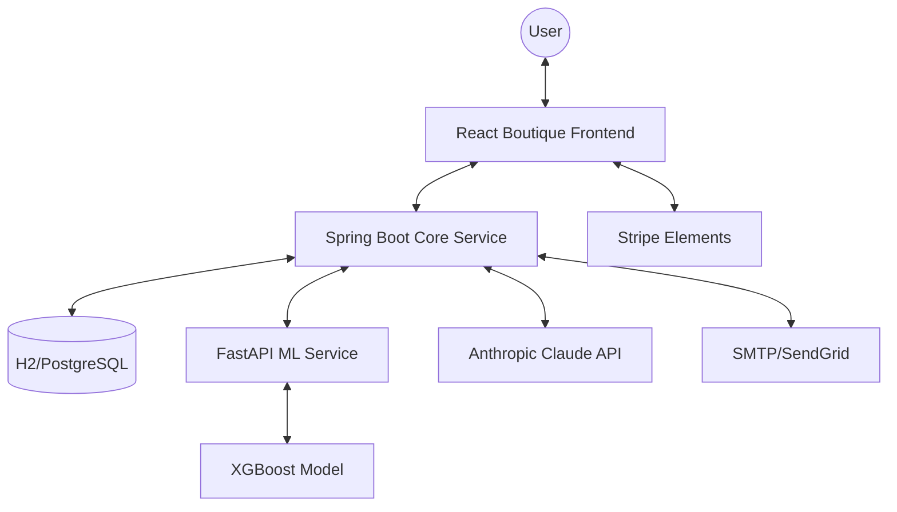

# SmartCart The Future of Luxury E-commerce 💎✨

<div align="center">
  
  
  
  
  
</div>

---

LuxIQ is not just an online store; it's an **AI-driven ecosystem** designed for the high-end boutique market. By blending cutting-edge **Natural Language Processing**, **Predictive Analytics**, and a **Hyper-Modern UI**, LuxIQ delivers an executive shopping experience that anticipates user needs and automates business logic.

## 🌟 Elite Features

| Feature | Description | Technology |
| :--- | :--- | :--- |
| **LUMI AI Assistant** | 🤖 24/7 personal shopper for product help & tracking. | Claude-3 / Anthropic |
| **Smart Size Guide** | 📏 Precision fit recommendations via user metrics. | FastAPI / Pandas |
| **Price Predictor** | 📉 ML-driven insights on when to buy for the best value. | XGBoost / Python |
| **Verified Reviews** | 🛡️ Authentic photo-backed feedback from real owners. | Cloudinary / JPA |
| **Inventory Vault** | 🔔 Real-time low-stock alerts & command center. | Glassmorphism UI |

---

## 🏗️ System Architecture



---

## 🚀 Experience the Platform

### 🛠️ Quick Installation

#### 🐍 1. ML Intelligence Layer (Python)
```bash
cd ml-service
pip install -r requirements.txt
python main.py
```

#### ☕ 2. Strategic Backend (Java)
```bash
cd backend-java
./mvnw spring-boot:run
```

#### ⚛️ 3. Boutique Frontend (React)
```bash
cd frontend
npm install
npm run dev
```

---

## ⚙️ Control Configuration

To unlock full platform potential, configure your `application.properties` and `.env` files:

> [!IMPORTANT]
> **Required API Keys:**
> - `anthropic.api.key`: Powering the LUMI AI concierge.
> - `stripe.secret.key`: Enabling secure, global transactions.
> - `spring.mail.*`: Driving automated customer relationship emails.

---

## 🎨 Design Philosophy
LuxIQ adheres to the **"Minimalist Obsidian"** design system, featuring:
- **Dynamic Themes**: Instant toggle between *Silk & Indigo* (Light) and *Midnight Obsidian* (Dark).
- **Glassmorphism**: Elegant transparency and blur effects for a premium feel.
- **Micro-Interactions**: Smooth, purposeful animations that guide the user journey.

---

<div align="center">
  <p><i>Crafted for the next generation of digital luxury.</i></p>
  
  
</div>
